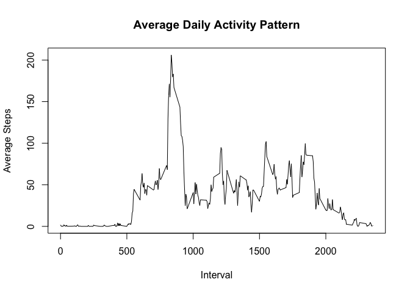
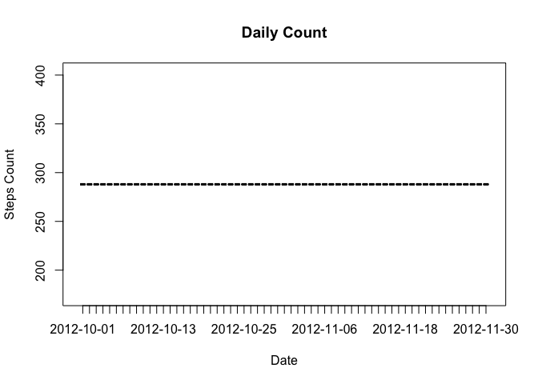
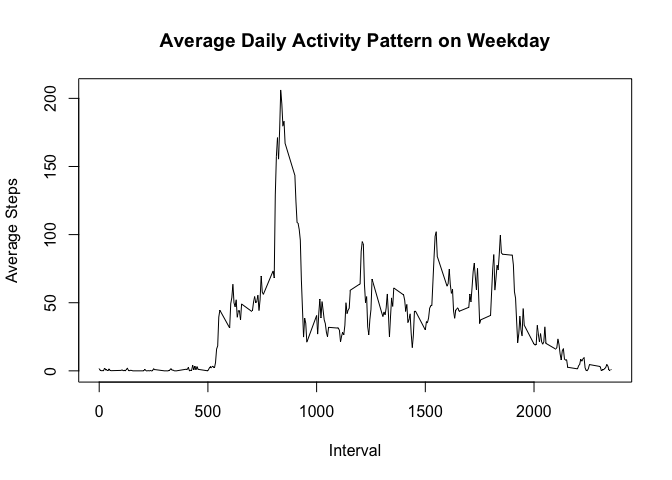

# Reproducible Research: Peer Assessment 1
Abhishek Jee  
19 April 2015  

## Loading and preprocessing the data

```r
library("dplyr")
```

```
## 
## Attaching package: 'dplyr'
## 
## The following object is masked from 'package:stats':
## 
##     filter
## 
## The following objects are masked from 'package:base':
## 
##     intersect, setdiff, setequal, union
```

```r
activity_raw <- tbl_df(read.csv("activity.csv"))
good <- complete.cases(activity_raw)
activity_tbl <- tbl_df(activity_raw[good,])
```

## What is mean total number of steps taken per day?

```r
daily_summary <- activity_raw %>%
  group_by(date) %>%
  summarize(steps_count = n(), steps_mean = mean(steps), steps_median = median(steps))

print(daily_summary, n = 100)
```

```
## Source: local data frame [61 x 4]
## 
##          date steps_count steps_mean steps_median
## 1  2012-10-01         288         NA           NA
## 2  2012-10-02         288  0.4375000            0
## 3  2012-10-03         288 39.4166667            0
## 4  2012-10-04         288 42.0694444            0
## 5  2012-10-05         288 46.1597222            0
## 6  2012-10-06         288 53.5416667            0
## 7  2012-10-07         288 38.2465278            0
## 8  2012-10-08         288         NA           NA
## 9  2012-10-09         288 44.4826389            0
## 10 2012-10-10         288 34.3750000            0
## 11 2012-10-11         288 35.7777778            0
## 12 2012-10-12         288 60.3541667            0
## 13 2012-10-13         288 43.1458333            0
## 14 2012-10-14         288 52.4236111            0
## 15 2012-10-15         288 35.2048611            0
## 16 2012-10-16         288 52.3750000            0
## 17 2012-10-17         288 46.7083333            0
## 18 2012-10-18         288 34.9166667            0
## 19 2012-10-19         288 41.0729167            0
## 20 2012-10-20         288 36.0937500            0
## 21 2012-10-21         288 30.6284722            0
## 22 2012-10-22         288 46.7361111            0
## 23 2012-10-23         288 30.9652778            0
## 24 2012-10-24         288 29.0104167            0
## 25 2012-10-25         288  8.6527778            0
## 26 2012-10-26         288 23.5347222            0
## 27 2012-10-27         288 35.1354167            0
## 28 2012-10-28         288 39.7847222            0
## 29 2012-10-29         288 17.4236111            0
## 30 2012-10-30         288 34.0937500            0
## 31 2012-10-31         288 53.5208333            0
## 32 2012-11-01         288         NA           NA
## 33 2012-11-02         288 36.8055556            0
## 34 2012-11-03         288 36.7048611            0
## 35 2012-11-04         288         NA           NA
## 36 2012-11-05         288 36.2465278            0
## 37 2012-11-06         288 28.9375000            0
## 38 2012-11-07         288 44.7326389            0
## 39 2012-11-08         288 11.1770833            0
## 40 2012-11-09         288         NA           NA
## 41 2012-11-10         288         NA           NA
## 42 2012-11-11         288 43.7777778            0
## 43 2012-11-12         288 37.3784722            0
## 44 2012-11-13         288 25.4722222            0
## 45 2012-11-14         288         NA           NA
## 46 2012-11-15         288  0.1423611            0
## 47 2012-11-16         288 18.8923611            0
## 48 2012-11-17         288 49.7881944            0
## 49 2012-11-18         288 52.4652778            0
## 50 2012-11-19         288 30.6979167            0
## 51 2012-11-20         288 15.5277778            0
## 52 2012-11-21         288 44.3993056            0
## 53 2012-11-22         288 70.9270833            0
## 54 2012-11-23         288 73.5902778            0
## 55 2012-11-24         288 50.2708333            0
## 56 2012-11-25         288 41.0902778            0
## 57 2012-11-26         288 38.7569444            0
## 58 2012-11-27         288 47.3819444            0
## 59 2012-11-28         288 35.3576389            0
## 60 2012-11-29         288 24.4687500            0
## 61 2012-11-30         288         NA           NA
```

## What is the average daily activity pattern?

```r
interval_summary <- activity_tbl %>%
  group_by(interval) %>%
  summarize(steps_count = n(), steps_mean = mean(steps), steps_median = median(steps))

plot(interval_summary$interval, interval_summary$steps_mean, type = "l", main = "Average Daily Activity Pattern", xlab = "Interval", ylab = "Average Steps")
```

 

## Imputing missing values

```r
activity_NA <- tbl_df(activity_raw[!good,])
activity_NA$steps <- inner_join(activity_NA, interval_summary)$steps_mean
```

```
## Joining by: "interval"
```

```r
activity_new <- rbind(activity_tbl, activity_NA)

daily_summary <- activity_new %>%
  group_by(date) %>%
  summarize(steps_count = n(), steps_mean = mean(steps), steps_median = median(steps))

plot(daily_summary$date, daily_summary$steps_count, type = "h", main = "Daily Count", xlab = "Date", ylab = "Steps Count")
```

 

## Are there differences in activity patterns between weekdays and weekends?

```r
if (weekdays(as.Date(activity_new$date)) %in% c("Saturday","Sunday"))
{
  activity_new$weekend <-"Weekend"
} else
{
  activity_new$weekend <-"Weekday"
}
```

```
## Warning in if (weekdays(as.Date(activity_new$date)) %in% c("Saturday",
## "Sunday")) {: the condition has length > 1 and only the first element will
## be used
```

```r
interval_summary_weekend <- activity_new %>%
  group_by(interval,weekend) %>%
  summarize(steps_count = n(), steps_mean = mean(steps), steps_median = median(steps)) %>%
  filter(weekend == "Weekend")

interval_summary_weekday <- activity_new %>%
  group_by(interval,weekend) %>%
  summarize(steps_count = n(), steps_mean = mean(steps), steps_median = median(steps)) %>%
  filter(weekend == "Weekday")

plot(interval_summary_weekday$interval, interval_summary_weekday$steps_mean, type = "l", main = "Average Daily Activity Pattern on Weekday", xlab = "Interval", ylab = "Average Steps")
```

 
